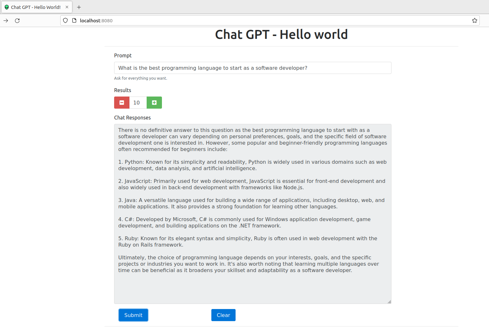
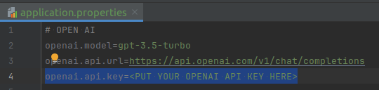

# Chat Gpt Hello World


### Technologies
- Spring-boot
- Thymeleaf
- Bootstrap
- Jquery


### Description
This project shows a single page with a prompt to you chat with the Chat-GPT 3.5 api

### Pre-requisites
- Java JDK
- Maven
- Generated api key for your own Chat-GPT account

### How to run

Clone the project
```bash
git clone https://github.com/denisgmarques/chat-gpt.git 
```

Change the api key
- 

Run the project
```bash
mvn spring-boot:run
```

Open the URL to test

[http://localhost:8080](http://localhost:8080)
